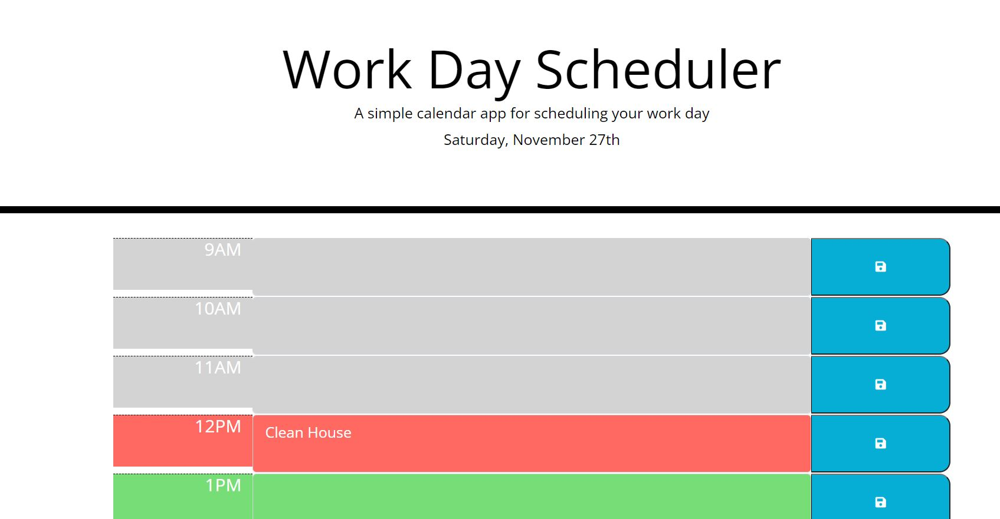

# WorkDayScheduler

Link to deployed site:

https://mhowitz.github.io/WorkDayScheduler/

##Description

This application was created to learn more about third party API's including Bootstrap, JQuery and Moment.JS. This application allows the user to add text inside a work day scheduler and it is saved into local storage so the user can re-open the page and see what is on their schedule for that day. The color changes based on whether the current time is in the past, present, or future. 
I created a lot of this application using HTML because the time blocks are always visible on the page, but I used JavaScript so the page gets the current hour of the day and so the colors change on the time block based on what hour it is. It also saves all of the text the user inputs into local storage.

##Installation

Click the github URL link to view the website. To view the code, click the link to the github repository. Download the repository to your computer and unzip the file. Open the index.html file to view the HTML code. Open the style.css file to view the style sheet. Open the script.js file to view the JavaScript code. 

##Usage

This screenshot displays how the website should look once the website is deployed:

The grey text areas indicate the time is in the past, the red time block indicates the present hour, and the green text block indicates hours that are in the future. When the user clicks the blue save button, the tasks are saved for that hour and will stay there when the page is reloaded.

##Credits

##License

MIT License

Copyright (c) 2021 Mikayla Howitz

Permission is hereby granted, free of charge, to any person obtaining a copy of this software and associated documentation files (the "Software"), to deal in the Software without restriction, including without limitation the rights to use, copy, modify, merge, publish, distribute, sublicense, and/or sell copies of the Software, and to permit persons to whom the Software is furnished to do so, subject to the following conditions:

The above copyright notice and this permission notice shall be included in all copies or substantial portions of the Software.

THE SOFTWARE IS PROVIDED "AS IS", WITHOUT WARRANTY OF ANY KIND, EXPRESS OR IMPLIED, INCLUDING BUT NOT LIMITED TO THE WARRANTIES OF MERCHANTABILITY, FITNESS FOR A PARTICULAR PURPOSE AND NONINFRINGEMENT. IN NO EVENT SHALL THE AUTHORS OR COPYRIGHT HOLDERS BE LIABLE FOR ANY CLAIM, DAMAGES OR OTHER LIABILITY, WHETHER IN AN ACTION OF CONTRACT, TORT OR OTHERWISE, ARISING FROM, OUT OF OR IN CONNECTION WITH THE SOFTWARE OR THE USE OR OTHER DEALINGS IN THE SOFTWARE.
